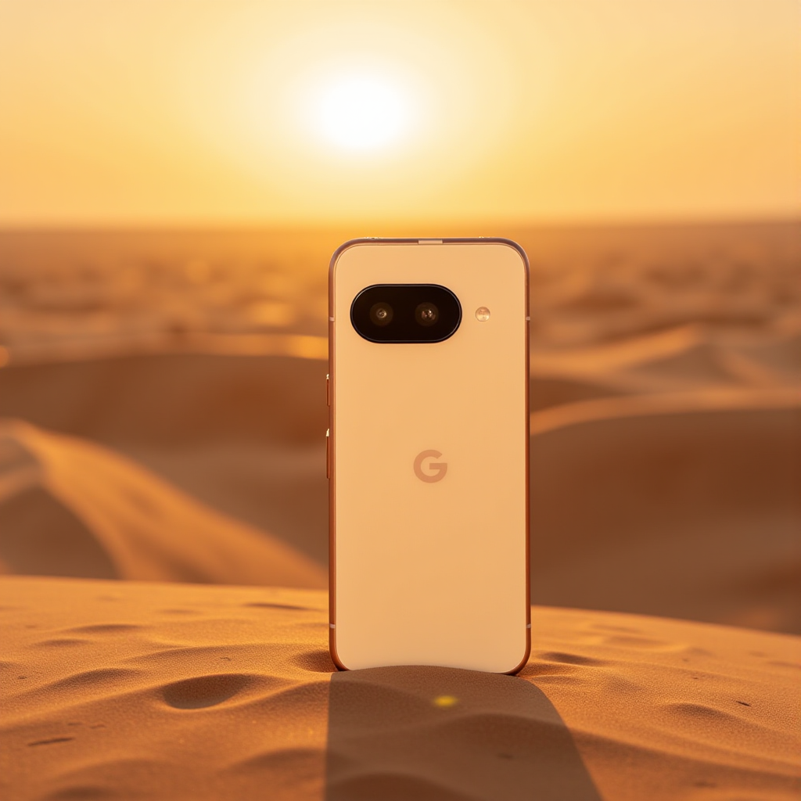
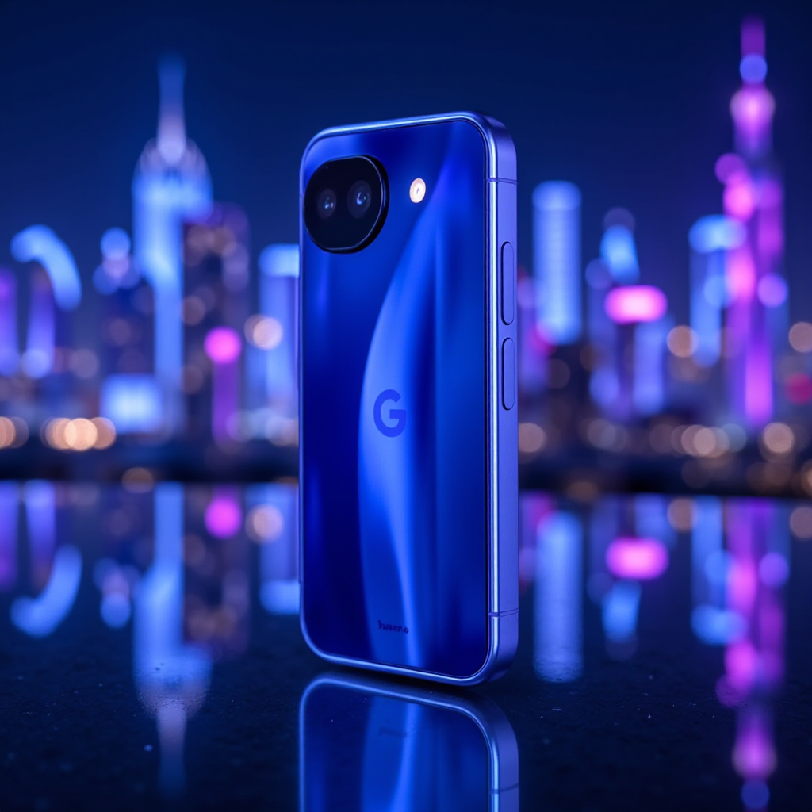
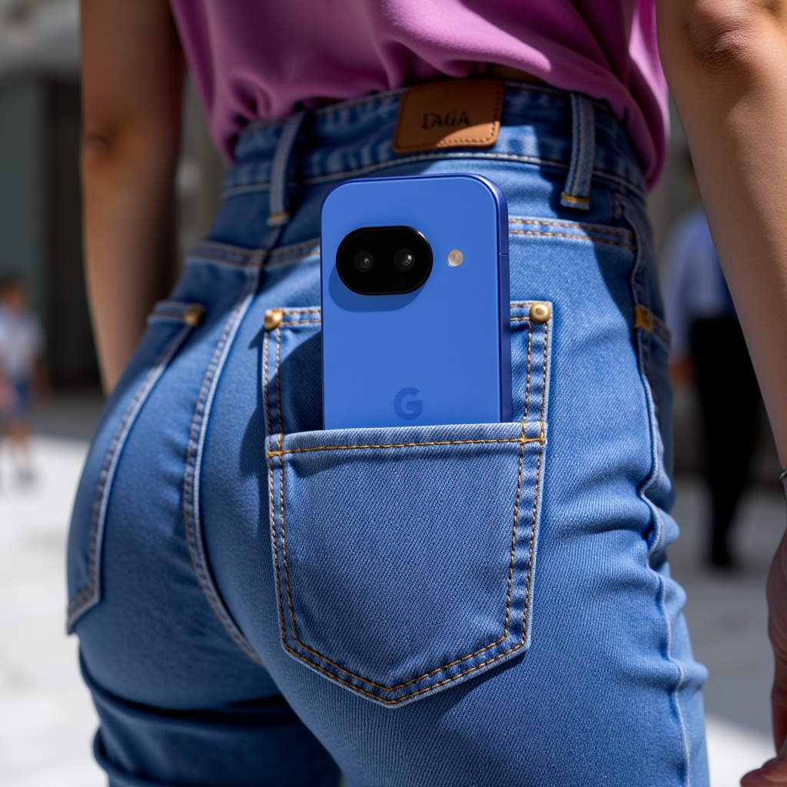
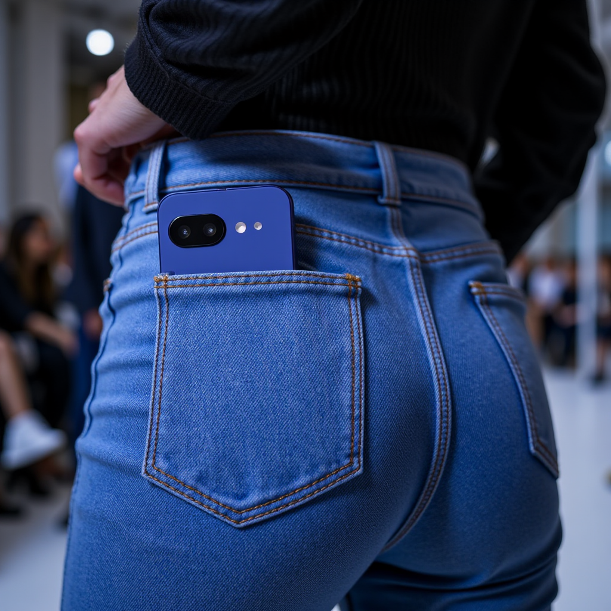
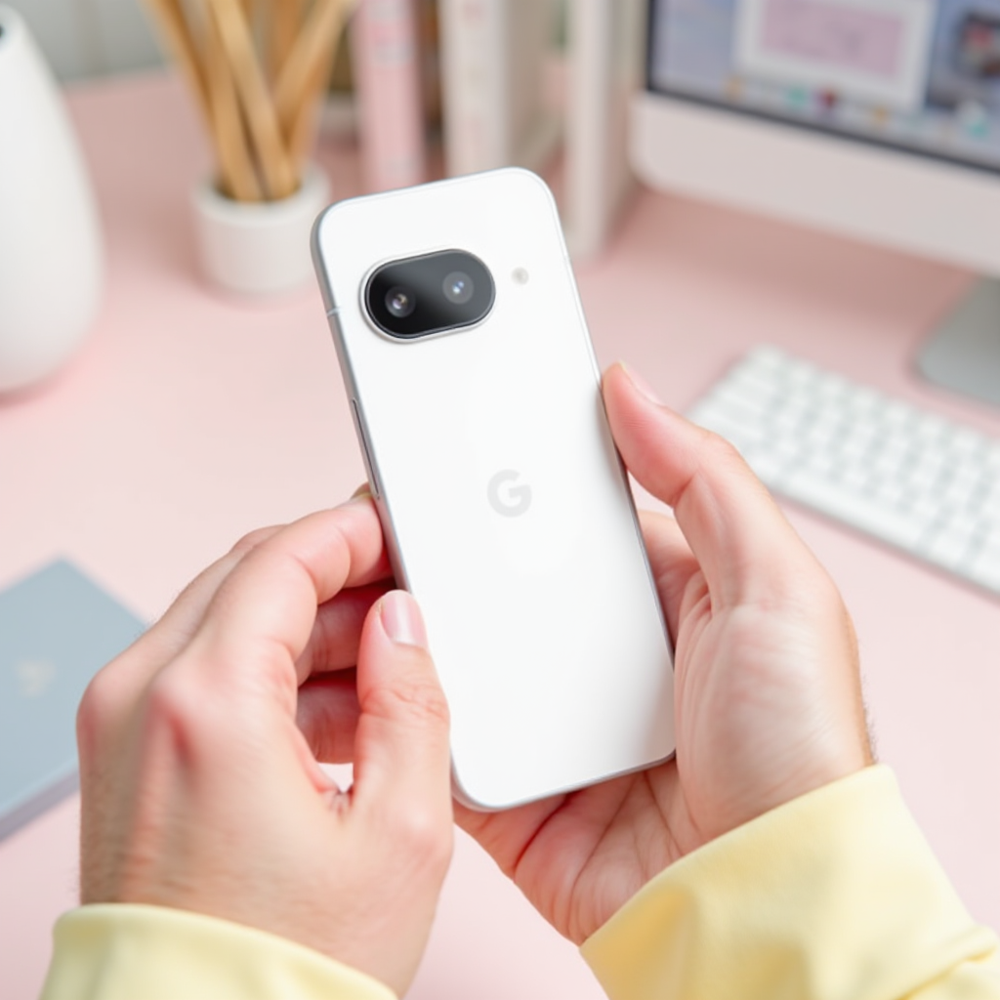

# Google Pixel 9a LoRA (Flux)

This repository contains training setup, workflow, and outputs for a custom **LoRA model trained on Google Pixel 9a** using Flux.

## Contents

- `Flux_LoRA_google_pixel_9a.json` → ComfyUI workflow file
- `pixel9a-flux-pnx.safetensors` → Trained LoRA model
- `sample output images/` → Sample generations
- `dataset/` → Images of Google Pixel 9a

## Dataset

The dataset was curated from publicly available images of **Google Pixel 9a**.

## Sample Outputs

Here are some samples:

## ⭐ Why this repo?

Mainly for **future reference** and to showcase LoRA training results.
